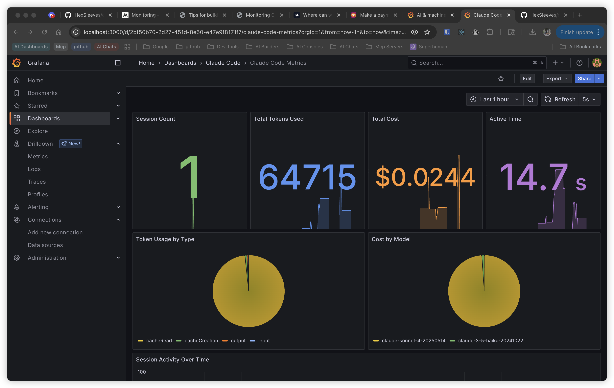
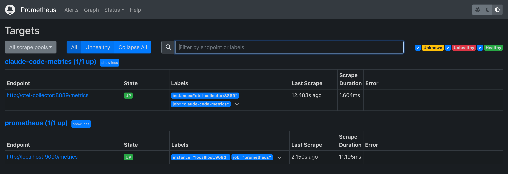
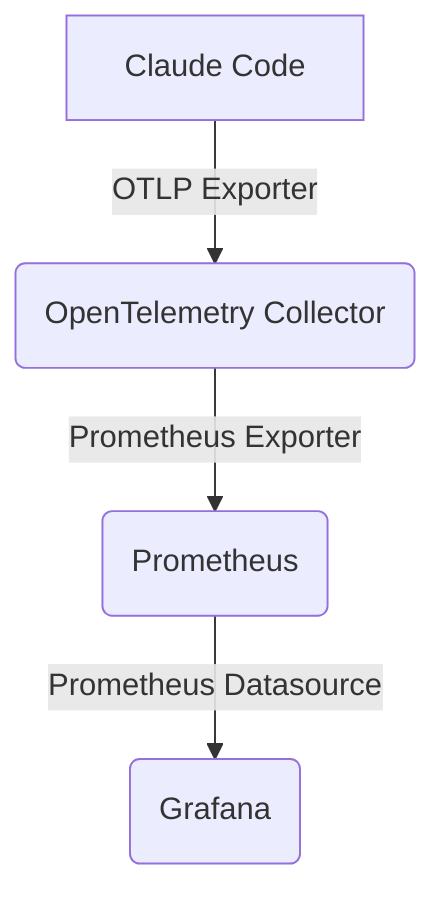
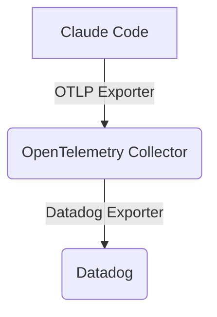

# Claude Code Telemetry with Grafana and Datadog

[](https://opensource.org/licenses/MIT)

This project provides a complete solution for monitoring Claude Code usage and performance. It uses OpenTelemetry to collect detailed metrics and supports two backends for storage and visualization: Prometheus/Grafana and Datadog.

<p align="center">
  
</p>

## ✨ Features

- **Dual Backend Support**: Choose between Prometheus/Grafana or Datadog for monitoring.
- **Comprehensive Dashboards**: Visualize key metrics in Grafana or Datadog.
- **Cost Tracking**: Monitor token usage and associated costs.
- **Performance Metrics**: Track session duration, lines of code changes, and more.
- **Extensible**: Easily add new metrics and visualizations.
- **Simple Setup**: Get up and running with a single script for your chosen backend.

## 📸 Screenshots

### Grafana

<table>
  <tr>
    <td></td>
    <td></td>
  </tr>
</table>

### Datadog

*(Datadog dashboard screenshot coming soon)*

## 🛠️ Prerequisites

- [Docker](https://docs.docker.com/get-docker/) (for Grafana/Prometheus stack)
- [Node.js](https://nodejs.org/en/download/) (v18 or higher)
- `bun` (or your preferred package manager)

## 🚀 Quick Start

1. **Clone the repository:**

    ```bash
    git clone https://github.com/jlecoq/claude-code-telemetry.git
    cd claude-code-telemetry
    ```

2. **Install dependencies:**

    ```bash
    bun install
    ```

3. **Choose your monitoring backend:**

    - **For Grafana/Prometheus (Default):**

        This script makes the necessary shell scripts executable.

        ```bash
        chmod +x setup-claude-code-telemetry.sh
        ./setup-claude-code-telemetry.sh
        ```

        Then start the monitoring stack:

        ```bash
        docker-compose up -d
        ```

    - **For Datadog:**

        This script configures your system to send metrics to Datadog. You will need your Datadog API key.

        ```bash
        export DD_API_KEY="your_datadog_api_key_here"
        chmod +x setup-datadog.sh
        ./setup-datadog.sh
        ```

4. **Set up environment variables:**

    This script configures your shell to send telemetry data to the OpenTelemetry Collector.

    ```bash
    ./setup-env.sh
    source ~/.zshrc # Or ~/.bashrc
    ```

5. **Access the dashboards:**
    - **Grafana**: <http://localhost:3000> (login with `admin`/`admin`)
    - **Prometheus**: <http://localhost:9090>
    - **Datadog**: Log in to your Datadog account to view the dashboard.
    - **OpenTelemetry Collector**: `localhost:4317` (gRPC), `localhost:4318` (HTTP)

6. **Generate Telemetry Data:**

    Run any Claude Code command in your terminal. The environment variables you set earlier will automatically route the telemetry data to the collector.

## 📊 Available Metrics

- **Session Metrics**: Track usage patterns and adoption.
- **Token Usage**: Monitor consumption by type (input, output, cache).
- **Cost Tracking**: Monitor spending across different models.
- **Productivity Metrics**: Lines of code modified, commits, and pull requests.
- **Performance**: Session duration and frequency.

## 🏛️ Architecture

The architecture supports two backends:

### Prometheus/Grafana



### Datadog



- **Claude Code**: Generates telemetry data using its built-in OpenTelemetry instrumentation.
- **OpenTelemetry Collector**: Receives data from Claude Code, processes it, and exports it to either Prometheus or Datadog.
- **Prometheus**: Scrapes and stores the metrics from the collector.
- **Grafana**: Queries Prometheus and visualizes the data in a dashboard.
- **Datadog**: Receives metrics from the collector for visualization and analysis.

## 📝 Environment Variables

The setup script configures the following environment variables to enable telemetry collection:

```bash
export CLAUDE_CODE_ENABLE_TELEMETRY=1
export OTEL_METRICS_EXPORTER=otlp
export OTEL_EXPORTER_OTLP_PROTOCOL=grpc
export OTEL_EXPORTER_OTLP_ENDPOINT=http://localhost:4317
export OTEL_METRIC_EXPORT_INTERVAL=30000 # 30 seconds for testing
```

## 🔧 Commands

| Command | Description |
| :--- | :--- |
| `./setup-claude-code-telemetry.sh` | Sets up the Prometheus/Grafana stack. |
| `./setup-claude-code-datadog.sh` | Sets up the Datadog integration. |
| `./setup-env.sh` | Sets up the required environment variables for telemetry. |
| `docker-compose up -d` | Starts all services for the Grafana stack in detached mode. |
| `docker-compose logs -f` | Tails the logs of all running services. |
| `docker-compose down` | Stops and removes all services. |
| `./test-setup.sh` | Runs a script to test the setup. |
| `bun run monitor` | Generates a usage report in the console. |
| `bun run build` | Compiles the TypeScript code. |
| `bun run dev` | Runs the monitoring script in development mode. |

## 📈 Monitoring Client

This repository includes a TypeScript-based monitoring client to programmatically access metrics from Prometheus.

### Usage

```typescript
import { ClaudeCodeMonitor } from './claude-code-monitor';

const monitor = new ClaudeCodeMonitor();

async function printReport() {
  await monitor.getUsageReport();
}

printReport();
```

### Methods

- `getMetrics()`: Fetches overall usage metrics.
- `getTokenUsageByType()`: Returns token usage broken down by type.
- `getCostByModel()`: Returns cost information broken down by model.
- `getUsageReport()`: Prints a formatted usage report to the console.

## 🔍 Troubleshooting

1. **Verify services are running (Grafana/Prometheus stack):**

    ```bash
    docker-compose ps
    ```

    All services should have the status `Up`.

2. **Check service logs for errors:**

    ```bash
    docker-compose logs <service-name> # e.g., otel-collector
    ```

3. **Check Prometheus targets:**

    Navigate to <http://localhost:9090/targets>. The `otel-collector` should be listed with a status of `UP`.

4. **Test Claude Code telemetry:**

    Run a Claude Code command and then query Prometheus for a metric like `claude_code_session_count_total`.

## 🤝 Contributing

Contributions are welcome! Please feel free to submit a pull request or open an issue.

1. Fork the repository.
2. Create your feature branch (`git checkout -b feature/AmazingFeature`).
3. Commit your changes (`git commit -m 'Add some AmazingFeature'`).
4. Push to the branch (`git push origin feature/AmazingFeature`).
5. Open a pull request.

## 📄 License

This project is licensed under the MIT License. See the [LICENSE](LICENSE) file for details.
